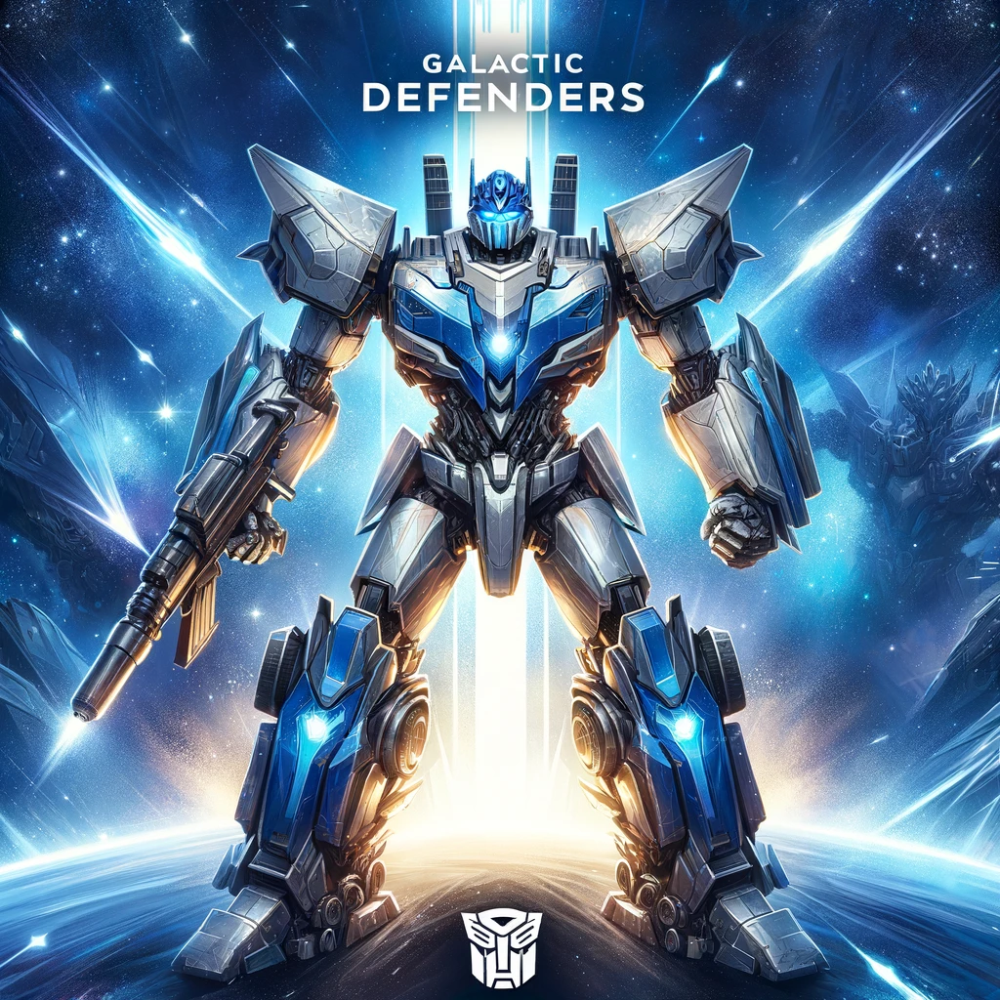

# Space Battle Game

Space Battle is a dynamic browser-based game where players control a spaceship and navigate through a field of stars and enemies. Players must dodge enemy attacks and destroy them with the ship's laser cannons while collecting stars for extra points.

[DEMO](https://srv19859.microhost.com.pl/galacticdefenders/index.html)

## Features

- Player movement control with arrow keys.
- Enemies spawn at regular intervals with increasing difficulty.
- Background music and sound effects for shooting and explosions.
- Collision detection for projectiles, enemies, and the player ship.
- Score tracking and display.
- An animated game over screen upon the player's ship destruction.

## Technologies

- HTML5
- CSS3
- JavaScript ES6

## Running the Game

To run the game, open the `index.html` file in any modern web browser.

## Game Controls

- **Arrow Keys:** Move the spaceship (Left, Right, Up, Down)
- **Spacebar:** Shoot lasers

## Code Structure

- `game.js`: Contains the main game logic and setup functions.
- `player.js`: Defines the player's spaceship behavior, including movement and shooting.
- `enemy.js`: Manages enemy behaviors, such as movement and spawning.
- `projectile.js`: Defines the projectiles fired by the player.
- `star.js`: Manages the background stars' behavior.
- `styles.css`: Contains all the styling for the game elements.
- `index.html`: The main HTML document.

## To do
* migration to Blazor
* addition of touchscreen controls

## Contributing

Contributions are welcome! Please fork the repository and open a pull request with your improvements.

## License
MIT